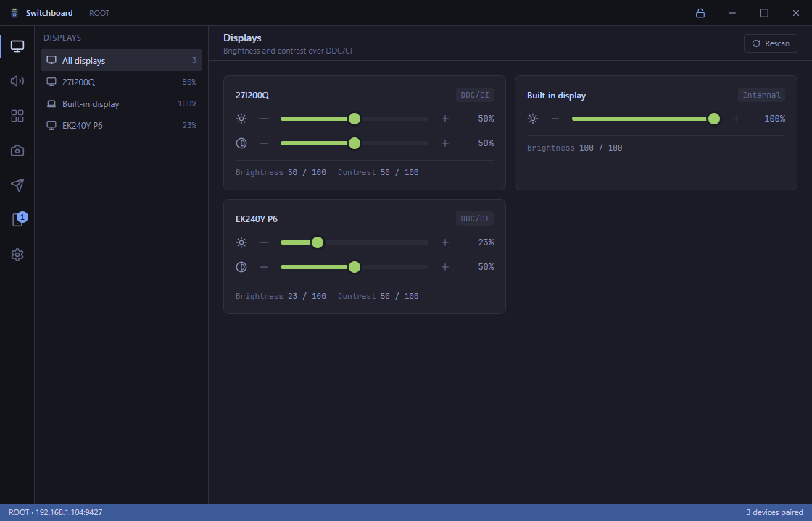
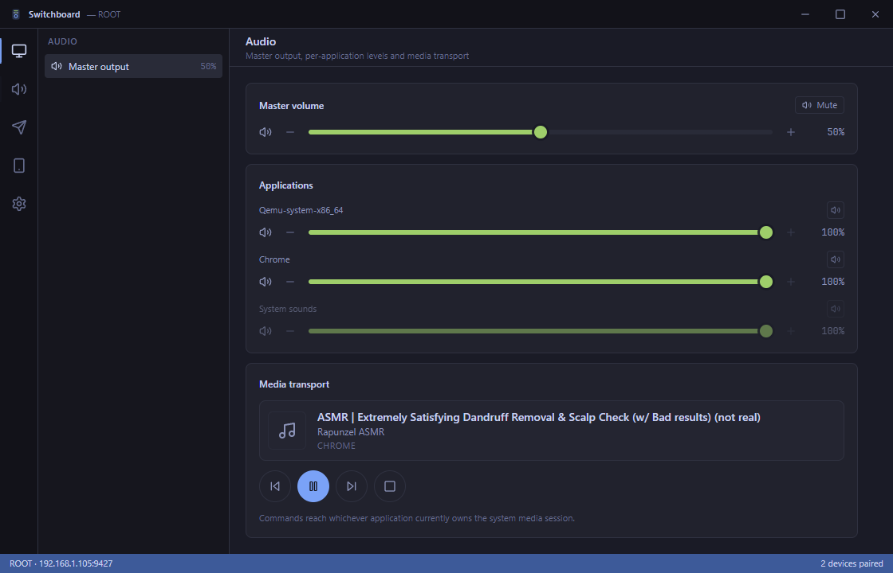
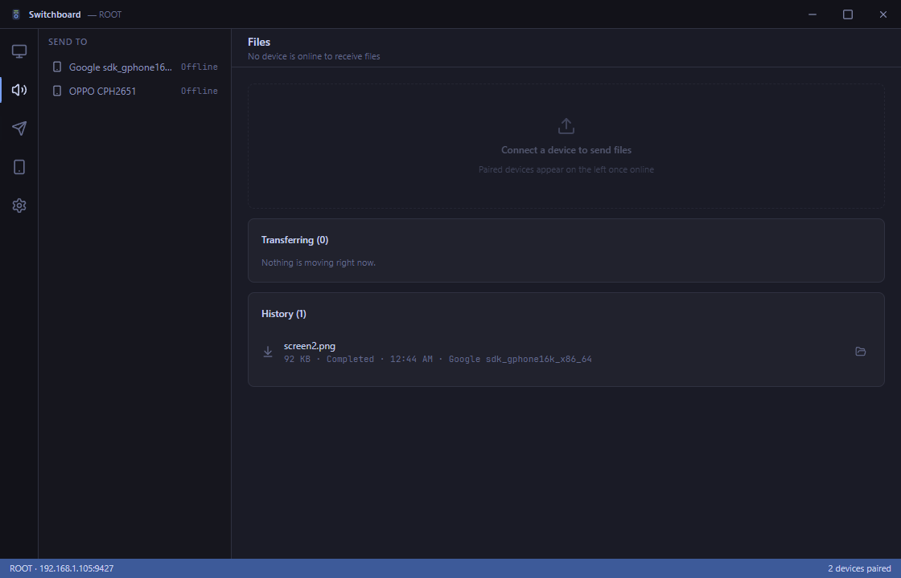
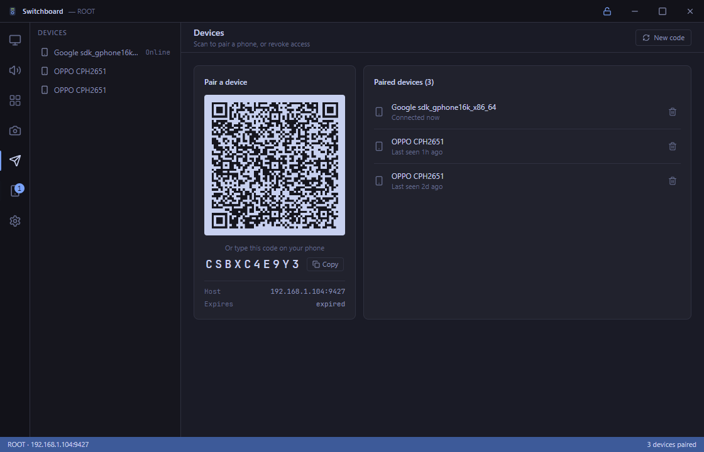
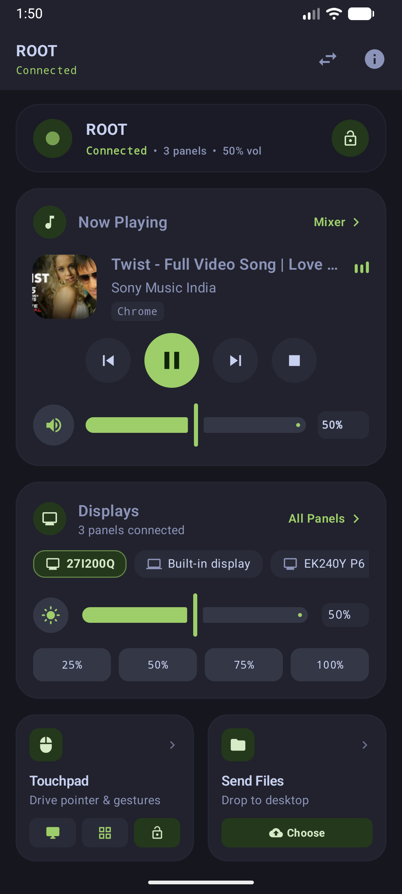
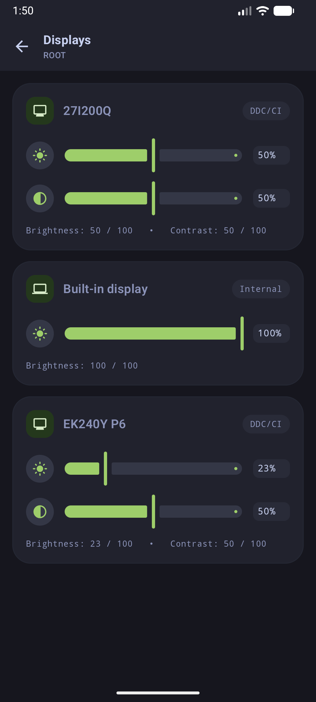
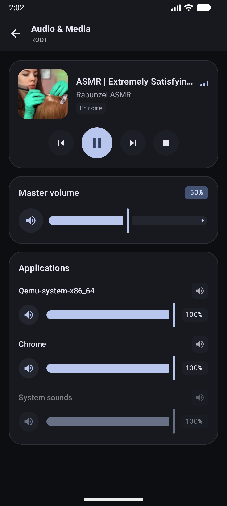
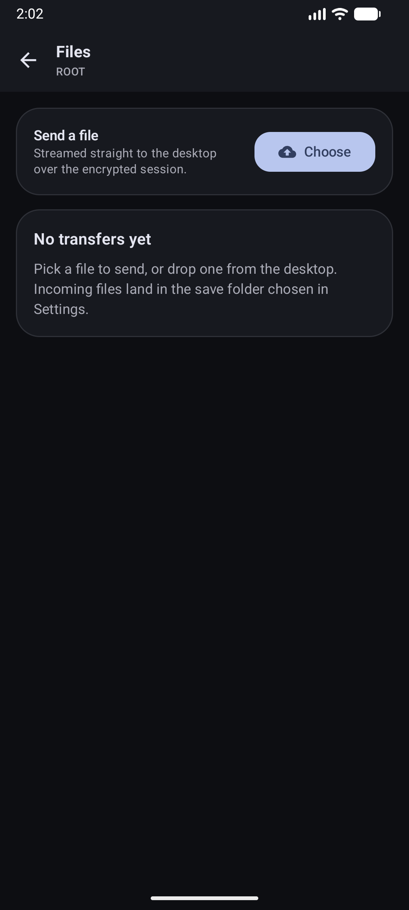
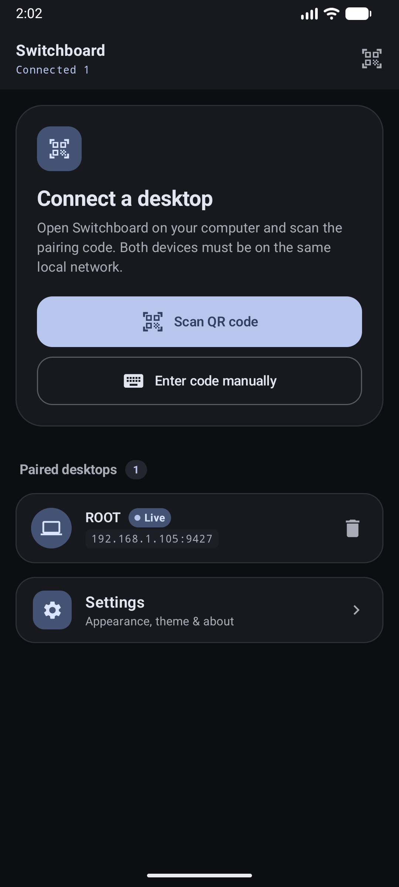
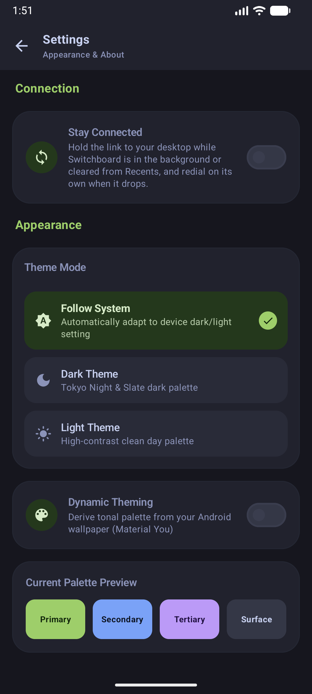

<div align="center">
  
  <h1>Switchboard</h1>
  <p><strong>Control your PC's hardware displays, audio mixer, and files directly from your phone.</strong></p>
  <p>Local network only. End-to-end encrypted. Zero accounts or cloud servers required.</p>

  <p>
    <a href="#why-switchboard">Why Switchboard</a> •
    <a href="#screenshots">Screenshots</a> •
    <a href="#features">Features</a> •
    <a href="#how-it-works">How It Works</a> •
    <a href="#-download--installation">Download</a> •
    <a href="#%EF%B8%8F-contributor--developer-setup">Contributors</a> •
    <a href="https://aiyu-ayaan.github.io/Switchboard/">Documentation</a>
  </p>

  <p>
    
    
    
    
    
    
    
    
  </p>
</div>

> [!NOTE]
> **Still in active development:** Switchboard's core functionality (DDC/CI display controls, per-app audio mixer, media transport, and encrypted file transfers) is working across Windows and Android. However, features, UI polish, and cross-platform ports are actively evolving. Feedback, bug reports, and suggestions are welcome!

---

## Why Switchboard?

If you use multiple monitors or play games on PC, you have probably run into these annoyances:
1. **Reaching behind your monitors to change brightness**: External monitors have stiff, clunky plastic buttons for their on-screen menus. Software "dimmer" apps don't actually dim the backlight—they just tint your screen gray and ruin contrast.
2. **Alt-tabbing out of games to change volume**: A teammate on Discord is blowing your ears out, or Chrome is playing music in the background, and you have to pause your game or tab away to find the Windows volume mixer.
3. **Sending a single file to your phone**: You end up emailing it to yourself, dumping it in a Discord DM, or uploading it to Google Drive just to get a picture or document between your phone and your PC.

**Switchboard fixes this.** You launch the desktop app, scan a quick QR code with your phone, and you get an instant, responsive control deck in your hands. Everything talks directly across your local Wi-Fi. No accounts to create, no subscriptions, no third-party servers tracking your hardware.

---

## Screenshots

### 🖥️ Desktop App (Electron + React)

Sits quietly in your system tray and lets you manage paired phones, check transfer history, and adjust settings.

| Multi-Monitor DDC/CI Controls | Master Audio, Per-App Mixer & Media Transport |
| :---: | :---: |
|  |  |

| End-to-End Encrypted File Transfers | Instant QR Pairing & Device Revocation |
| :---: | :---: |
|  |  |

---

### 📱 Android App (Kotlin + Jetpack Compose)

Clean, fluid Material You interface that adapts to your wallpaper colors and supports full dark mode.

| Main Dashboard | Hardware Display Sliders | Media Controls & App Mixer |
| :---: | :---: | :---: |
|  |  |  |

| Encrypted File Transfers | QR Scanner & Host Switcher | Appearance & Dynamic Theme |
| :---: | :---: | :---: |
|  |  |  |

---

## Features

- **Real Hardware Monitor Control (DDC/CI)**:
  Adjusts the real backlight and contrast hardware on your external screens using VESA DDC/CI commands over DisplayPort/HDMI/Type-C. Works with laptop built-in panels too (via WMI). Sliders automatically respect the real minimum and maximum ranges reported by each monitor.
- **Per-Application Volume Mixer**:
  Shows volume sliders for every program playing sound right now (Chrome, Discord, games, Spotify). Turn down one noisy app without touching your master volume.
- **Switch Your Sound Output**:
  Move your PC's playback between speakers, a headset, or your monitor's HDMI audio straight from your phone — no digging through the Windows Sound settings. Playback, multimedia and call audio all follow the choice together.
- **Media Playback & Album Art**:
  Syncs with Windows System Media Transport Controls (SMTC). Shows track titles, artists, playback controls (Play, Pause, Skip, Prev), and extracts full-res album art directly to your phone.
- **Zero-Password QR Pairing**:
  Point your phone camera at your PC screen once to pair. The app does an ephemeral **X25519 (ECDH)** key exchange and derives symmetric keys on the spot. If you don't want to use the camera, there's a 10-character code you can type instead.
- **Encrypted Local File Sharing**:
  Send files back and forth over your local network. Everything is encrypted end-to-end and verified with SHA-256 hashes. Uses Android's Storage Access Framework (SAF), so the app never asks for intrusive full-storage permissions.
- **Finds Your PC By Itself**:
  Desktops announce themselves on your Wi-Fi over mDNS, so pairing no longer starts with hunting for an IP address — your PC just shows up in the list. If your router hands your PC a new address later, your phone follows it instead of failing to reconnect.
- **Multi-PC Switching**:
  Pair your phone with your desktop PC and your laptop. Switch between them with one tap from the top bar.
- **Runs in System Tray**:
  Closing the desktop window minimizes it to the tray so your phone stays connected while you game or work.

---

## How It Works

```
        Android App (Phone / Tablet)
          │  Jetpack Compose · Material You
          │  X25519 KeyStore · Storage Access Framework
          │
          ▼  Encrypted WebSocket (JSON RPC) + HTTP (Files)
          │  [Local Wi-Fi Only · No Internet Required]
          │
        Desktop Daemon (Go)
          ├── SQLite (Pairing records & host identity)
          ├── Windows DDC/CI (dxva2.dll) & WMI (Display brightness)
          ├── Windows WASAPI (Master volume, per-process mixer & output routing)
          ├── mDNS / DNS-SD (`_switchboard._tcp` host advertisement)
          └── Windows SMTC (Media playback & artwork)
          │
          ▼  Loopback HTTP (127.0.0.1:9427)
          │
        Desktop GUI (Electron + React)
          └── Frameless UI · Tokyo Night Theme · System Tray
```

The Go daemon sits between your phone and your operating system. When you drag a brightness slider on your phone, the command travels over an encrypted local WebSocket, the daemon translates it into a native VESA MCCS command, and your monitor's physical backlight changes within milliseconds.

---

## 🚀 Download & Installation

You don't need to build from source to use Switchboard! Pre-compiled, ready-to-run releases are available for both PC and Android on GitHub:

👉 **[Download Latest Switchboard Release](https://github.com/aiyu-ayaan/Switchboard/releases)**

### What You'll Need
- **PC**: Windows 10/11 (for DDC/CI monitor control and WASAPI audio mixer), Linux, or macOS.
- **Phone**: Android 8.0 (Oreo, API 26) or newer.
- **Network**: Both devices connected to the same local Wi-Fi router or subnet (no internet required).

---

### Step 1: Download & Install Desktop (PC)
1. Head to the **[Latest Releases](https://github.com/aiyu-ayaan/Switchboard/releases)** page on your PC.
2. Under **Assets**, download the desktop installer:
   - **Windows**: `Switchboard-Setup.exe` (or the standalone portable archive).
3. Run the installer or launch the executable.
4. Switchboard starts the background Go control daemon and sits conveniently in your Windows system tray.
   *(If prompted by Windows Defender Firewall, check **Private networks** and click **Allow access**).*

### Step 2: Download & Install Mobile (Android)
1. On your Android device, open **[Latest Releases](https://github.com/aiyu-ayaan/Switchboard/releases)** in your browser.
2. Under **Assets**, download the Android application package:
   - **Android**: `Switchboard.apk` (or `app-release.apk`).
3. Tap the downloaded APK to install.
   *(If prompted by Android security to allow installing unknown apps, tap **Settings**, enable **Allow from this source**, and proceed with installation).*

### Step 3: Pair & Control
1. **Open Desktop App**: Click the Switchboard icon in your system tray or app menu, and select the **Paired Devices** tab to view your pairing QR code (and 10-character manual PIN).
2. **Scan on Phone**: Open Switchboard on your Android phone and tap **Scan QR Code**. Point your phone camera at the PC screen.
   - *Alternatively, tap **Found on this network** to discover your PC automatically via local mDNS and enter the pairing code manually.*
3. **You're Connected!**: Your PC's physical monitor brightness sliders, per-app volume mixer, air mouse touchpad, and encrypted file transfer immediately appear on your phone.

---

## 🛠️ Contributor & Developer Setup

Are you a developer looking to contribute to Switchboard, add features, or build directly from source?

Full code setup, inner-loop development workflows, and build instructions are documented in:
👉 **[CONTRIBUTING.md](CONTRIBUTING.md)** (Monorepo setup, inner-loop dev commands, and commit conventions)
👉 **[Documentation: Contributor Setup Guide](https://aiyu-ayaan.github.io/Switchboard/contributing)**

### Quick Developer Commands
```bash
# Clone repository with documentation submodules
git clone --recurse-submodules https://github.com/aiyu-ayaan/Switchboard.git
cd Switchboard

# Install dependencies
pnpm install

# Run Desktop Host in development mode (Go daemon + Electron frontend)
pnpm dev

# Build and run Android Client on connected device / emulator
pnpm android:run
```
See **[CONTRIBUTING.md](CONTRIBUTING.md)** for detailed prerequisites (Go 1.22+, Node 20+, pnpm 9+, Android Studio Ladybug+), architecture details, and testing guidelines.

---

## Security & Privacy

We built Switchboard because we wanted a tool we could trust on our own home networks:
- **No cloud relays**: Data never leaves your router. If your internet goes down, Switchboard keeps working.
- **No accounts or passwords**: Trust is established mathematically via asymmetric cryptography (X25519).
- **Hardened Electron frontend**: The desktop UI runs with context isolation and no direct network permissions; it only talks to the daemon over `127.0.0.1`.
- **Instant revocation**: Hit the trash can icon on your desktop or choose "Forget Host" on your phone to delete the session keys immediately.

---

## Documentation

Need more details on how things are built? Check out the guides in [`docs/docs/`](docs/docs/) or visit the [Switchboard Documentation Portal](https://aiyu-ayaan.github.io/Switchboard/):

- 📘 [**Docs Portal Intro**](docs/docs/intro.md) - Full documentation index
- 🧭 [**Product Overview**](docs/docs/overview.md) - Deep dive on problems and hardware support
- 🚀 [**Download & Installation**](docs/docs/getting-started.md) - End-user setup and release packages
- 🛠️ [**Contributor Setup Guide**](docs/docs/contributing.md) - Monorepo development, build flags, and APK packaging
- 🏛️ [**Architecture**](docs/docs/architecture.md) - Process boundaries, daemon internals, and IPC
- 🔐 [**Security & Pairing**](docs/docs/security-pairing.md) - Cryptographic handshake and cipher specs
- 📡 [**Wire Protocol Reference**](docs/docs/api-protocol.md) - WebSocket message formats and commands
- 🖥️ [**DDC/CI Display Guide**](docs/docs/displays-ddcci.md) - VESA MCCS implementation details
- 🎧 [**Audio Mixer, Output Routing & SMTC Guide**](docs/docs/audio-mixer.md) - Windows Core Audio and Media APIs
- 📶 [**Host Discovery**](docs/docs/discovery.md) - mDNS/DNS-SD advertisement and why it grants no trust
- 📁 [**File Transfer Subsystem**](docs/docs/file-transfer.md) - Streaming, chunking, and SAF integration
- ❓ [**Troubleshooting & FAQ**](docs/docs/troubleshooting.md) - Firewall hints, monitor quirks, and Wi-Fi tips

---

## License

MIT © [aiyu-ayaan](https://github.com/aiyu-ayaan). Feel free to use it, inspect the code, or contribute!
