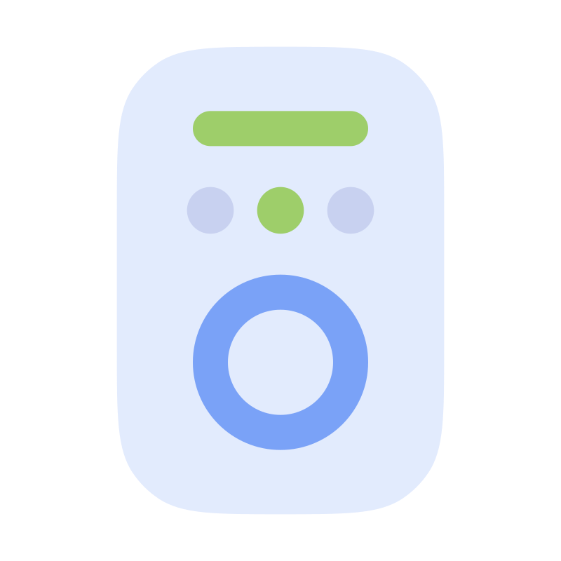

# Switchboard Documentation Portal

Welcome to the comprehensive technical and operational documentation for **Switchboard**.

  

Switchboard provides an ultra-low-latency, zero-password encrypted bridge between Android devices and host personal computers. This documentation portal covers all aspects of the system, including architecture, protocols, hardware interfaces, security, and developer setup.

---

## 📚 Documentation Index

### 1. Fundamentals & Architecture
- [**Product Overview & Capabilities**](./overview.md): Product vision, comparison with traditional tools, hardware compatibility, and phase milestones.
- [**System Architecture & Topology**](./architecture.md): Full-stack monorepo design, Go backend daemon, Electron desktop host, and native Android client.
- [**Getting Started & Build Guide**](./getting-started.md): Complete prerequisites, repository setup, development workflow, and production release packaging.

### 2. Security & Protocols
- [**Security & Pairing Protocol**](./security-pairing.md): Cryptographic specification, zero-password trust model, X25519 ECDH key exchange, AEAD encryption, and device revocation.
- [**API & Wire Protocol Reference**](./api-protocol.md): JSON-over-WebSocket protocol, client command envelopes, host event streams, and loopback REST API endpoints.
- [**Host Discovery (mDNS / DNS-SD)**](./discovery.md): `_switchboard._tcp` advertisement, the TXT record, why it carries no host key, and how the phone follows a desktop that changed address.

### 3. Hardware & System Subsystems
- [**Displays & DDC/CI Hardware Controls**](./displays-ddcci.md): VESA MCCS monitor communication via `dxva2.dll`, multi-monitor detection, and WMI laptop display control.
- [**Audio Mixer, Output Routing & SMTC Media Transport**](./audio-mixer.md): Windows Core Audio (WASAPI), per-process audio session control, default output endpoint switching via `IPolicyConfig`, and System Media Transport Controls (SMTC) integration.
- [**Encrypted File Transfer Subsystem**](./file-transfer.md): Chunked P2P encrypted file streaming, SHA-256 integrity validation, and Android Storage Access Framework (SAF).

### 4. Operations & Support
- [**Troubleshooting & FAQ**](./troubleshooting.md): Diagnosis and resolution for local network pairing, Windows Firewall configuration, DDC/CI monitor issues, and Android background tasks.

---

## 🖼️ Application Overview

### Desktop Application
The desktop application is built with **Electron**, **React**, and **Tailwind CSS**. It connects to the Go daemon over local loopback (`127.0.0.1`) and can run minimized in the system tray.

- **Displays**: Multi-monitor sliders for brightness and contrast.
- **Audio & Media**: Master volume, per-app session mixer, and media transport controls.
- **File Transfers**: Real-time upload/download progress and transfer history.
- **Paired Devices**: QR code display, manual pairing codes, and device revocation.
- **Settings**: Download folder selection, transfer rate units, and tray behavior.

### Mobile Client
The mobile application is a native **Android** app built with **Kotlin** and **Jetpack Compose**, adhering to Material Design 3 Expressive guidelines.

- **Quick Connect**: CameraX-powered QR scanner and manual IP/code entry.
- **Hardware Display Cards**: Real-time slider feedback tracking hardware limits.
- **Media Controller**: Rich player card with album art extraction and application volume sliders.
- **File Transfer**: Integrated with Android Storage Access Framework (SAF).
- **Customization**: Dark/light modes and dynamic wallpaper theming (Material You).
