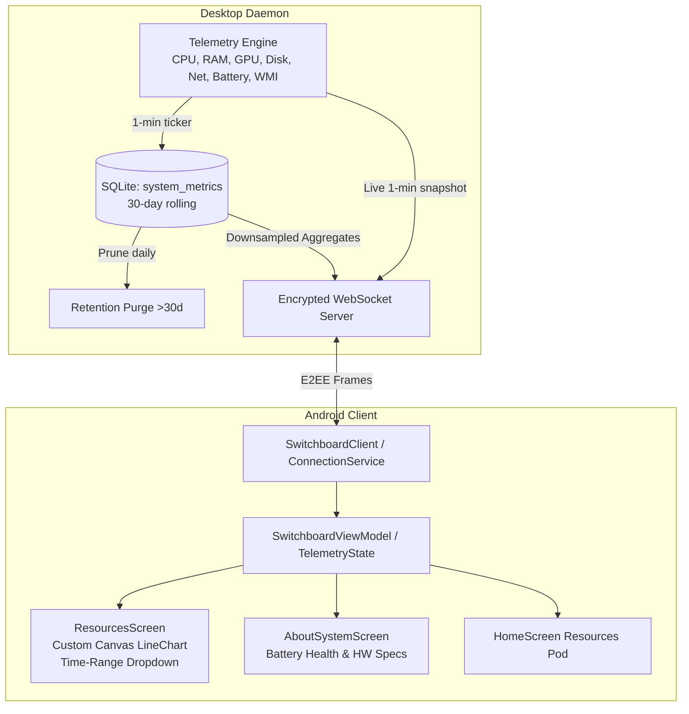

# System Resources Telemetry & About System Design Specification

## 1. Overview
This specification details the end-to-end design for the **System Resources & Telemetry Subsystem** in Switchboard, providing real-time system monitoring, 30-day historical time-series analytics, downsampled query buckets, and a detailed **About System** hardware and battery health inspection page.

The architecture spans:
1. **Desktop Daemon (`backend/`)**: Windows/host telemetry collectors for CPU, Memory, GPU, Disk I/O, Network I/O, Thermals, Top Processes, and Battery Health.
2. **Persistence & Rollup (`backend/internal/db/`)**: SQLite storage with 1-minute sampling, automatic 30-day pruning, and tiered downsampling buckets (`1m`, `1h`, `12h`, `24h`, `1w`, `30d`).
3. **Protocol Layer (`backend/internal/protocol/` & `mobile/.../Protocol.kt`)**: Encrypted WebSocket request/reply actions and periodic live broadcasts.
4. **Android Client (`mobile/`)**: Jetpack Compose interactive charts with Canvas bezier rendering, time-range dropdown selector, live 60-second refreshes, and an About System hardware & battery health dashboard.

---

## 2. Architecture & Data Flow



---

## 3. Host Telemetry Engine (`backend/internal/system/`)

### 3.1 Metric Sampling (`telemetry_windows.go`)
- **CPU**: Total processor utilization % via `GetSystemTimes` / performance counter deltas.
- **Memory**: Total, used, and available physical memory via `GlobalMemoryStatusEx`.
- **GPU**: 3D engine utilization and dedicated VRAM usage via DXGI / D3DKMT / WMI `Win32_VideoController`.
- **Disk I/O**: Cumulative sector read/write rates converted to bytes/sec via `GetDiskFreeSpaceExW` and performance counters.
- **Network I/O**: Interface RX/TX rates via `GetIfTable2`.
- **Thermals**: CPU package temp & GPU core temp via WMI `MSAcpi_ThermalZoneTemperature` (or Win32 thermal interfaces when available).
- **Top Processes**: Top 5 processes ordered by CPU % and memory working set via `CreateToolhelp32Snapshot` / `EnumProcesses`.

### 3.2 Battery Health & System Specifications (`about_windows.go`)
- **Battery Health**:
  - Present: boolean.
  - Charging / AC line status: read via `GetSystemPowerStatus`.
  - Current charge %, estimated runtime.
  - Cycle count, design capacity (mWh), and full charge capacity (mWh) read via WMI `root\wmi` (`BatteryStaticData`, `BatteryFullChargedCapacity`).
  - Wear level % computed as:
    $$\text{Wear} = \max\left(0, \frac{\text{DesignCapacity} - \text{FullCapacity}}{\text{DesignCapacity}} \times 100\right)$$
- **Hardware Specs**:
  - CPU model, socket/package, core count, logical threads, base clock.
  - Total physical RAM, memory type (DDR4/DDR5), form factor.
  - GPU adapter names, driver versions, dedicated video memory.
  - Storage drive volumes (`C:`, `D:`, etc.) with filesystem label, total bytes, and free bytes.
  - OS Edition, build number, 64-bit architecture, and system uptime (via `GetTickCount64`).

---

## 4. SQLite Storage & Downsampling (`backend/internal/db/`)

### 4.1 Schema
```sql
CREATE TABLE IF NOT EXISTS system_metrics (
    id INTEGER PRIMARY KEY AUTOINCREMENT,
    timestamp INTEGER NOT NULL,
    cpu_percent REAL NOT NULL,
    ram_used_bytes INTEGER NOT NULL,
    ram_total_bytes INTEGER NOT NULL,
    gpu_percent REAL NOT NULL,
    gpu_mem_used_bytes INTEGER NOT NULL,
    disk_read_bps INTEGER NOT NULL,
    disk_write_bps INTEGER NOT NULL,
    net_rx_bps INTEGER NOT NULL,
    net_tx_bps INTEGER NOT NULL,
    cpu_temp REAL,
    gpu_temp REAL
);
CREATE INDEX IF NOT EXISTS idx_system_metrics_ts ON system_metrics(timestamp);
```

### 4.2 Auto-Pruning
A background loop runs daily to delete entries older than 30 days:
```sql
DELETE FROM system_metrics WHERE timestamp < strftime('%s', 'now', '-30 days');
```

### 4.3 Tiered Downsampling Rollups
To ensure responsive queries and small network payloads (<20 KB):
| Range | Query Window | Bucket Size | Grouping Expression | Result Points |
| :--- | :--- | :--- | :--- | :--- |
| **`1m`** | Live | N/A (Latest 1 sample) | N/A | 1 |
| **`1h`** | Past 60 mins | 1 minute | `(timestamp / 60) * 60` | ~60 points |
| **`12h`** | Past 12 hours | 5 minutes | `(timestamp / 300) * 300` | ~144 points |
| **`24h`** | Past 24 hours | 10 minutes | `(timestamp / 600) * 600` | ~144 points |
| **`1w`** | Past 7 days | 1 hour | `(timestamp / 3600) * 3600` | ~168 points |
| **`30d`** | Past 30 days | 4 hours | `(timestamp / 14400) * 14400` | ~180 points |

Aggregates compute `AVG(cpu_percent)`, `AVG(ram_used_bytes)`, `MAX(ram_total_bytes)`, `AVG(gpu_percent)`, `AVG(disk_read_bps)`, `AVG(disk_write_bps)`, `AVG(net_rx_bps)`, `AVG(net_tx_bps)`, `AVG(cpu_temp)`, `AVG(gpu_temp)`.

---

## 5. Protocol Specification

### 5.1 Actions
- `system.resources.query`:
  - Request: `{ "range": "1h" | "12h" | "24h" | "1w" | "30d" }`
  - Response: `{ "range": string, "points": [ MetricPoint... ] }`
- `system.resources.live`:
  - Push message sent every 60s while connected, or on explicit request:
  - `{ "current": MetricPoint, "topProcesses": [ ProcessItem... ], "drives": [ DriveItem... ] }`
- `system.about.query`:
  - Request: `{}`
  - Response: Full hardware, battery health, and OS specifications JSON.

---

## 6. Android Client UI (`mobile/`)

### 6.1 Resources Screen (`ResourcesScreen.kt`)
- **Time-Range Dropdown**:
  - Matches user's uploaded reference UI with history clock icon and selection label.
  - Dropdown options: `1 minute`, `1 hour`, `12 hours`, `24 hours`, `1 week`, `30 days`.
- **Live Glance Cards**:
  - 4 high-level stat cards: CPU %, RAM %, GPU %, Net speed.
- **Canvas Multi-Line Chart (`ResourceLineChart.kt`)**:
  - Cubic bezier curve interpolation.
  - Tokyo Night theme palette (`#9ECE6A`, `#7AA2F7`, `#BB9AF7`, `#F7768E`).
  - Gradient surface fill under curves.
  - Drag scrubber with timestamp and metric readout popup.
  - Filter tabs: `All`, `CPU & GPU`, `Memory`, `Network & Disk`.
- **Top Processes Card**:
  - Top 5 processes displaying name, PID, CPU usage %, and RAM MB.
- **Thermals & Drive Capacity**:
  - Dual gauge for CPU and GPU core thermals.
  - Horizontal stacked progress bars for mounted drives.

### 6.2 About System Page (`AboutSystemScreen.kt`)
- **Battery Health Card**:
  - Circular health gauge (e.g. `96% Health`).
  - Wear %, cycle count, design capacity vs full charge capacity (mWh).
  - Power connection state (AC Line / Discharging / Full).
  - Desktop fallback banner when no battery is present.
- **System & Hardware Specifications**:
  - Processor: Brand, architecture, core/thread topology, clock speed.
  - Graphics: GPU models, driver version, VRAM.
  - Memory: RAM capacity, type, speed.
  - Operating System: Windows build, edition, uptime display.

---

## 7. Multi-Agent Implementation Workflow

To execute efficiently without context saturation:
1. **Agent 1 (Backend & Telemetry Engine)**: Implements Go metrics collection (`telemetry_windows.go`, `about_windows.go`), SQLite storage (`db/telemetry.go`), and downsampling queries.
2. **Agent 2 (Protocol & Bridge Integration)**: Implements protocol structs in `backend/internal/protocol` and `mobile/.../Protocol.kt`, WebSocket handlers in `server/`, and tests.
3. **Agent 3 (Android UI & Chart Components)**: Builds `ResourceLineChart.kt`, `ResourcesScreen.kt`, `AboutSystemScreen.kt`, and integrates into `HomeScreen.kt` and `SwitchboardViewModel.kt`.
4. **Verification Agent**: Runs backend Go tests and Android compile/unit tests to verify end-to-end functionality.
